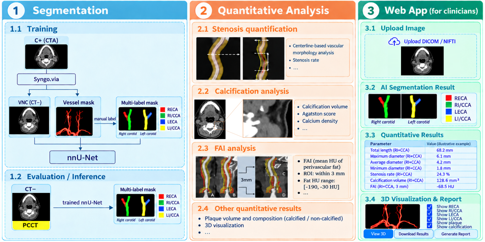
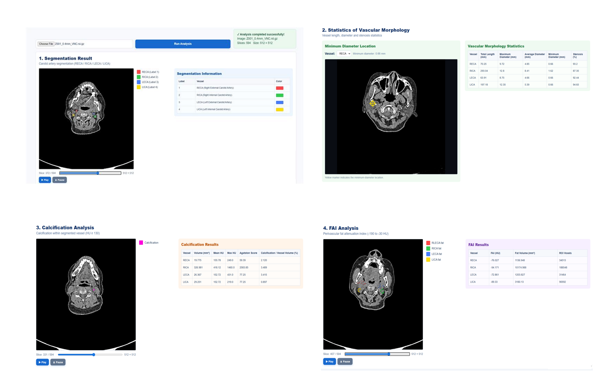

# Automated Carotid Artery Analysis Pipeline

An end-to-end medical imaging pipeline for automated carotid artery
segmentation and quantitative vascular analysis from CT imaging.

The project combines nnU-Net-based segmentation with automated
post-processing and a clinician-facing analysis interface.

## Project Overview

The pipeline was developed for automated analysis of carotid arteries
from PCCT/CTA imaging.

The workflow includes:

1. CT image preprocessing
2. Multi-label carotid artery segmentation
3. Vascular centerline extraction
4. Vessel morphology analysis
5. Stenosis quantification
6. Calcification analysis
7. Perivascular fat attenuation (FAI) analysis
8. Visualization through an analysis interface

## Pipeline

The overall workflow integrates CT image preprocessing, nnU-Net-based segmentation, post-processing, quantitative vascular analysis, and visualization.




## Segmentation

The segmentation pipeline is based on nnU-Net.

Major preprocessing steps include:

- Image and label validation
- Voxel spacing standardization
- Label remapping
- nnU-Net preprocessing
- Model training
- Automated inference

The model performs 4-label carotid artery segmentation.

- **Label 1:** Right External Carotid Artery (RECA)
- **Label 2:** Right Internal and Common Carotid Artery region (RI/CCA)
- **Label 3:** Left External Carotid Artery (LECA)
- **Label 4:** Left Internal and Common Carotid Artery region (LI/CCA)

## Post-processing

The post-processing pipeline uses:

- SimpleITK
- NumPy
- 3D Slicer

The pipeline automatically extracts vascular centerlines and calculates
quantitative imaging measurements.

## Quantitative Outputs

The system generates:

- Vessel diameter
- Stenosis percentage
- Calcification measurements
- Perivascular fat attenuation (FAI)
- Vascular morphology statistics
- Segmentation masks
- Calcification maps
- FAI maps

## Web Interface

A web-based interface was developed to integrate segmentation results and quantitative vascular analysis into a unified visualization workflow.

The interface presents carotid artery segmentation, vascular morphology and stenosis measurements, calcification analysis, and perivascular fat attenuation (FAI) analysis.



## Repository Structure

```text
carotid-pcct-ai/
├── nnunet training data/
│   └── Scripts for data validation, preprocessing, training, and inference
│
├── post-processing and web-creating/
│   └── Post-processing, quantitative vascular analysis, and web visualization
│
├── pipeline_overview.png
├── web_interface.png
├── .gitignore
└── README.md

```
## Requirements


The project was developed in Python and uses the following core tools and libraries:

- Python
- PyTorch
- nnU-Net
- NumPy
- SimpleITK
- VMTK
- 3D Slicer

## Disclaimer

This repository is intended for research and educational purposes only. The pipeline is a research prototype and has not been validated for clinical use.
